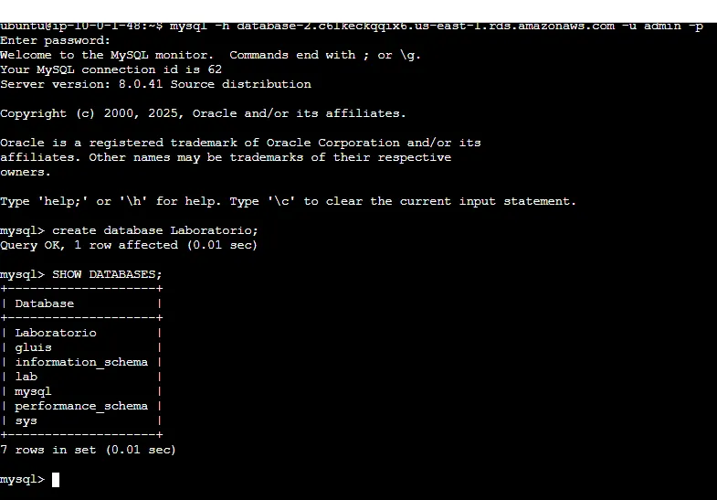
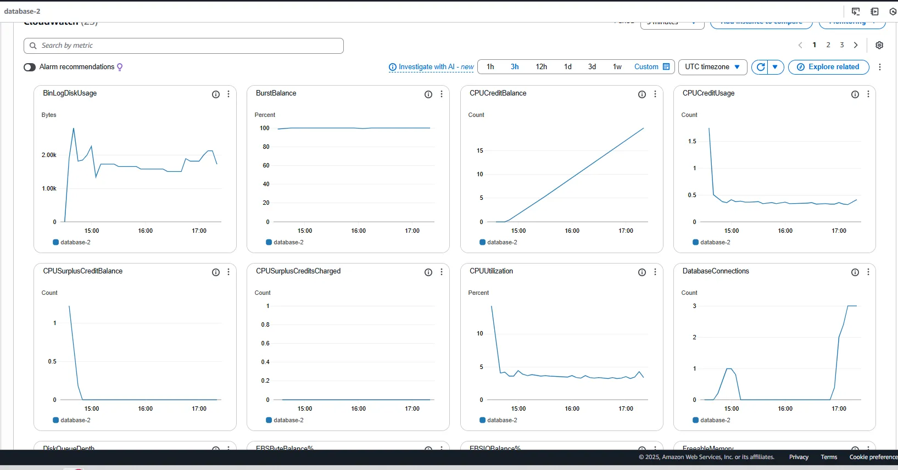

# 🧪 LAB AWS - Amazon RDS com VPC Personalizada (via Console)

Este laboratório demonstra como criar um ambiente seguro e funcional utilizando o **Amazon RDS**, com conectividade controlada por uma **VPC personalizada** e boas práticas de segurança e monitoramento.

---
### Diagrama da Solução

## ✅ Objetivo

Provisionar uma instância **Amazon RDS (MySQL)** com:

- VPC com sub-redes públicas e privadas
- Segurança baseada em grupos de segurança (SG)
- Conectividade controlada via Bastion Host (SSH)
- Monitoramento ativo com Enhanced Monitoring
- Backup habilitado (automático por padrão)
### VPC - Foi criada uma VPC com o CIDR block 10.0.0.0/16, contendo as seguintes sub-redes:
- Sub-redes públicas: 10.0.0.0/24 e 10.0.1.0/24
- Sub-redes privadas: 10.0.2.0/23 e 10.0.4.0/23
- NAT
- IGW

---
###  Foram configurados dois grupos de segurança
- SG-Bastion-Host: com uma regra de entrada (Inbound Rule) permitindo acesso via SSH (porta 22) exclusivamente a partir do meu IP.
- SG-Database: com uma regra permitindo acesso à porta do MYSQL(porta 3306) somente a partir do grupo de segurança SG-Bastion-Host, garantindo assim maior segurança na comunicação entre as instâncias.

---
###  Banco de dados RDS
- Um banco de dados MySQL foi provisionado em uma das sub-redes privadas (10.0.2.0/23)
  
---
### Linux Bastion Host
- Uma instância Linux Bastion Host, localizada em uma sub-rede pública, foi criada para permitir acesso seguro ao banco de dados
  
---
### Teste de conectividade
- Teste de conectividade mostrou que a EC2 e o RDS (porta 3306) está funcionando corretamente
  
  
---
### Enhanced Monitoring 
- Foi habilitado o Enhanced Monitoring para monitoramento
 
---
## 🛠️ Serviços utilizados

- Amazon VPC (com sub-redes, IGW e NAT)
- Amazon EC2 (Bastion Host)
- Amazon RDS (MySQL)
- Amazon CloudWatch (Enhanced Monitoring)
- AWS IAM (acessos mínimos necessários)

---

## 🌐 Arquitetura

- **CIDR da VPC**: `10.0.0.0/16`
- **Sub-redes públicas**: `10.0.0.0/24`, `10.0.1.0/24`
- **Sub-redes privadas**: `10.0.2.0/23`, `10.0.4.0/23`
- **Internet Gateway**: associado à VPC
- **NAT Gateway**: para acesso à internet pelas sub-redes privadas

---

## 🔐 Grupos de Segurança

- `SG-Bastion-Host`: permite acesso SSH (porta 22) **apenas do meu IP**
- `SG-Database`: permite acesso MySQL (porta 3306) **apenas do SG-Bastion-Host**

---

## 🛠️ Etapas realizadas

1. Criada VPC com sub-redes públicas e privadas.
2. Associado IGW e NAT Gateway corretamente.
3. Criados grupos de segurança com regras restritivas.
4. Instância RDS (MySQL) criada em sub-rede privada `10.0.2.0/23`.
5. Instância EC2 (Bastion Host) criada em sub-rede pública.
6. Acesso ao banco testado via Bastion (`ssh + mysql -h <endpoint>`)
7. Ativado o **Enhanced Monitoring** para a instância RDS.

---
