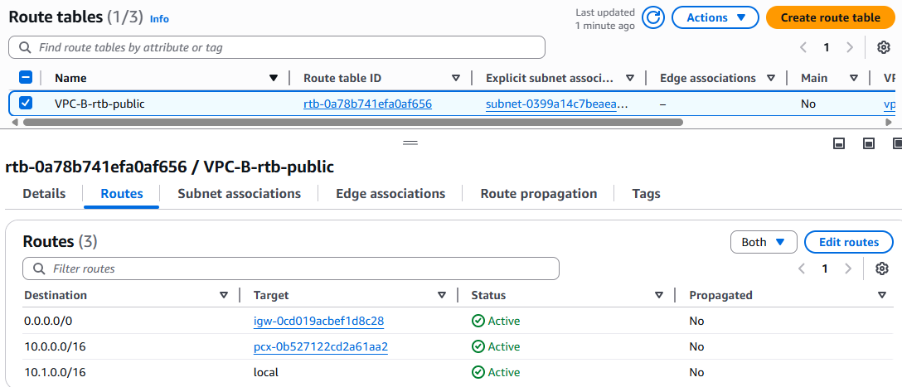
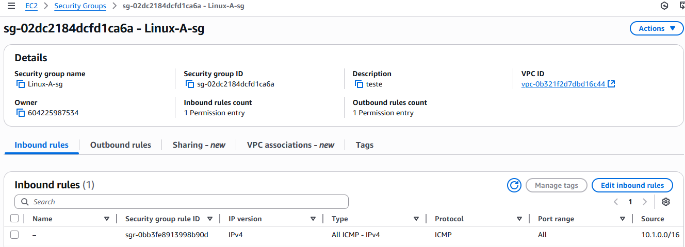
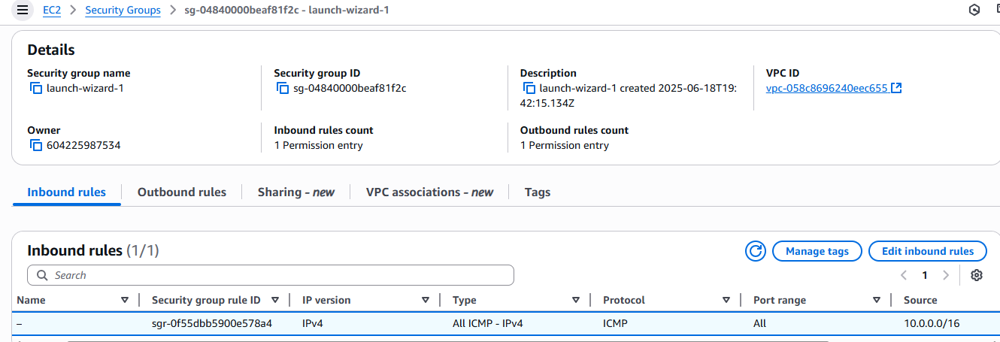
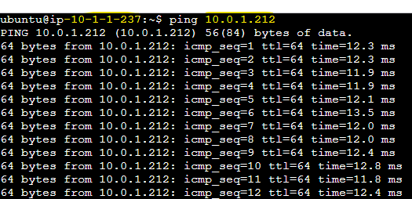

# 🛰️ Desafio 2 – Comunicação entre VPCs com VPC Peering

Este laboratório demonstra como estabelecer comunicação privada entre duas VPCs distintas na AWS, utilizando **VPC Peering**, roteamento cruzado e regras de segurança apropriadas.

---

## 🎯 Objetivo

Habilitar comunicação privada entre instâncias EC2 localizadas em diferentes redes (VPC-A e VPC-B), simulando um cenário multi-ambiente ou multi-conta.

---

## 🌐 Arquitetura

---

## 🛠️ Tarefas Realizadas

1. **Criar duas VPCs:**
   - `VPC-A` → CIDR: `10.0.0.0/16`
   - `VPC-B` → CIDR: `10.1.0.0/16`

2. **Criar Subnets Públicas em cada VPC:**
   - Subnet A: `10.0.1.0/24` em `us-east-1a`
   - Subnet B: `10.1.1.0/24` em `us-east-1b`

3. **Criar EC2s nas Subnets Públicas:**
   - `EC2-A` em VPC-A
   - `EC2-B` em VPC-B

4. **Estabelecer o VPC Peering:**
   - Criar Peering Connection entre `VPC-A` e `VPC-B`
   - Aceitar o peering manualmente

5. **Editar Route Tables:**
   - Em `VPC-A`, adicionar rota para `10.1.0.0/16` via Peering
   - Em `VPC-B`, adicionar rota para `10.0.0.0/16` via Peering

6. **Configurar Security Groups:**
   - Liberar ICMP e SSH entre as instâncias

7. **Testes de Conectividade:**
   - SSH de `EC2-A` para `EC2-B` usando IP privado
   - Testar `ping` entre instâncias

---

## ✅ Resultados Esperados

- Comunicação entre EC2-A e EC2-B ocorre via IP privado
- Tráfego não passa pela internet
- Segurança garantida via SGs e rotas privadas

---

## 📷 Evidências

| Componente                         | Screenshot                              |
|-----------------------------------|------------------------------------------|
| `VPC-A` → CIDR: `10.0.0.0/16`     |             |
| `VPC-B` → CIDR: `10.1.0.0/16`     |             |
| Peering Connection                |     |
| Route Table - VPC-A              |               |
| Route Table - VPC-B              |               |
| Security Group - VPC-A           |               |
| Security Group - VPC-B           |               |
| Ping EC2-A → EC2-B               |           |
| Ping EC2-B → EC2-A               |           |
