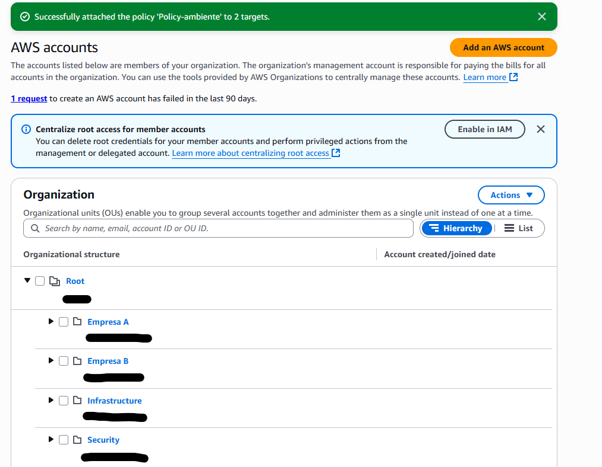
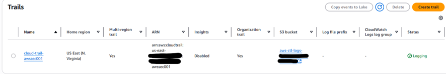
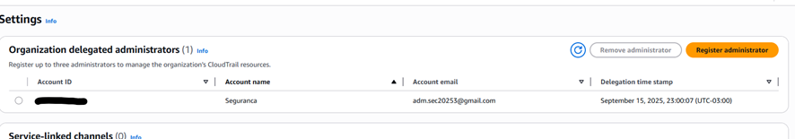
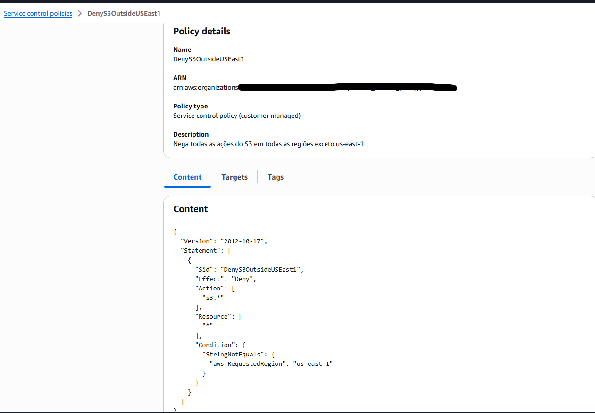
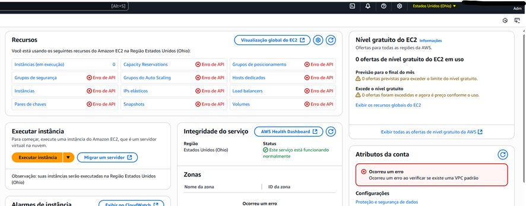
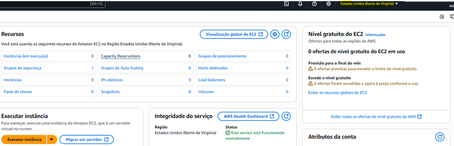

# 🌐 Laboratório AWS Organizations

## 🎯 Objetivo
Este laboratório demonstra a simulação de gerenciamento centralizado de contas AWS utilizando o **AWS Organizations**, aplicando **boas práticas** de segurança, governança e padronização.

---

## 🛠️ Tarefas Realizadas

1. **Criação de Organizational Units (OUs)**  
   - Estrutura criada seguindo boas práticas de organização.  

2. **Habilitação de Acesso Confiável**  
   - Ativado **AWS Account Management** e **IAM Access Analyzer** para acesso confiável entre contas.  

3. **Configuração de CloudTrail**  
   - Criado um **Trail multi-region**.  
   - Como se trata de ambiente de laboratório, **não foi habilitado** o *Log file SSE-KMS encryption* nem o envio para **CloudWatch Logs**.  
   - Delegada a conta **`adm-seguranca`** para administração do CloudTrail.  

4. **Service Control Policies (SCPs)**  
   Foram criadas as seguintes políticas:  
   - **TAG obrigatória `Project`** para criação de buckets S3.  
   - Obrigatoriedade de **tags em recursos** (ex.: `Project`, `Environment`, `Owner`).  
   - Restrição de regiões permitidas: apenas **`us-east-1`** e **`sa-east-1`**.  

5. **Tag Policies**  
   - Criadas políticas para **padronização e obrigatoriedade de tags** em recursos AWS.  

---

## ✅ Resultados Esperados

- Estrutura organizacional clara, com **OUs bem definidas**.  
- Governança aprimorada via **SCPs** e **Tag Policies**.  
- **CloudTrail multi-region** ativo para auditoria centralizada.  
- Controle de **tags obrigatórias** em recursos críticos.  
- Restrição de **regiões permitidas** para criação de recursos.  

---

## 📷 Evidências de Configuração

| Componente                | Screenshot                              |
|----------------------------|------------------------------------------|
| Organizational Units (OUs) |                   |
| IAM Access Analyzer        |                 |
| CloudTrail                 |   |
| Administração do CloudTrail           |   |
| Service Control Policy     |                 |
| Tag Policies – **Bloqueio** (acesso negado na região us-east-2)           |        |
| Tag Policies – **Permitido** (acesso permitido na região us-east-1)             |        |

---

## 📘 Recursos Recomendados

- [AWS Organizations – Documentação Oficial](https://docs.aws.amazon.com/organizations/latest/userguide/orgs_introduction.html)  
- [Service Control Policies – AWS Docs](https://docs.aws.amazon.com/organizations/latest/userguide/orgs_manage_policies_scps.html)  
- [Tag Policies – AWS Docs](https://docs.aws.amazon.com/organizations/latest/userguide/orgs_manage_policies_tag-policies.html)  
- [AWS CloudTrail – Documentação](https://docs.aws.amazon.com/awscloudtrail/latest/userguide/cloudtrail-user-guide.html)  
