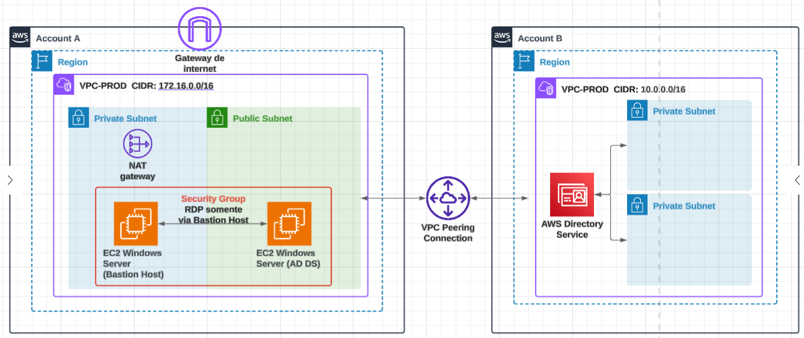
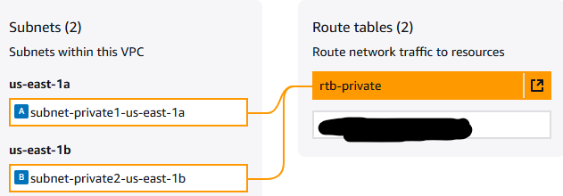
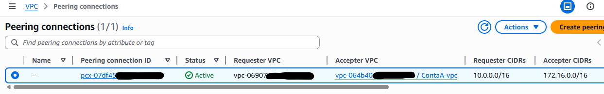
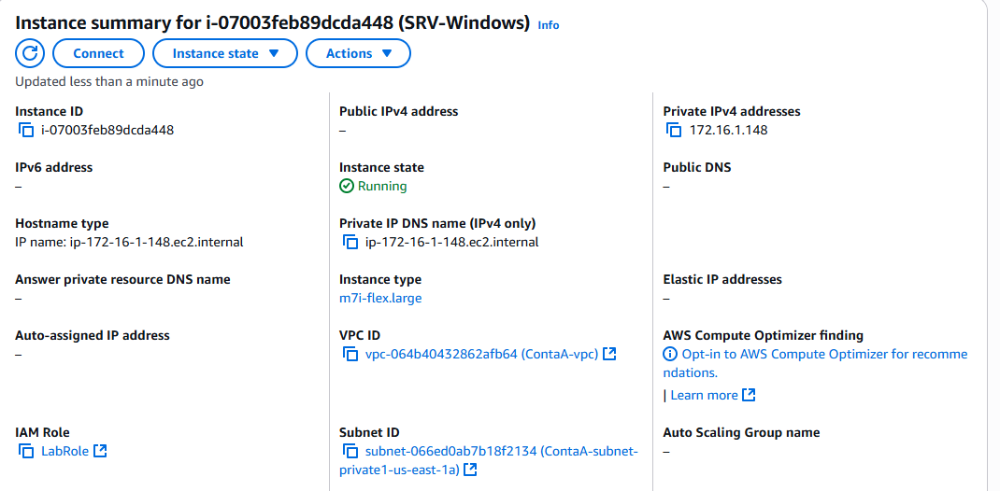
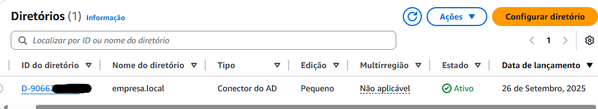
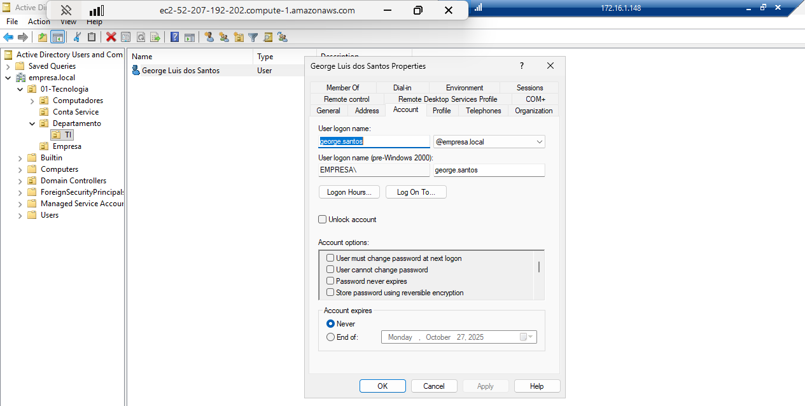
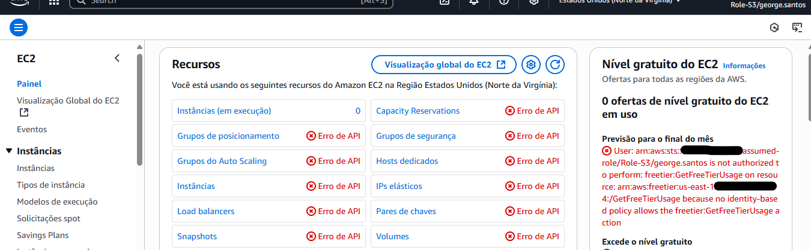

# 🧪 Laboratório AWS: Multi-Account AD + AWS AD Connector

Este laboratório demonstra a integração de um **Active Directory self-managed** em uma conta AWS (**Conta A**) com workloads em outra conta AWS (**Conta B**), utilizando **VPC Peering** e o serviço **AWS AD Connector**.

---

##  Arquitetura

---

## 🔧 Etapas Realizadas

### 1️⃣ Configuração do AD na Conta A
- Criação da **VPC (172.16.0.0/16)** com subnets pública e privada.  
- Deploy de **EC2 Windows Server (Bastion Host)** na **subnet pública**, permitindo acesso remoto via RDP.  
- Deploy de **EC2 Windows Server (AD DS)** na **subnet privada**, acessado apenas pelo Bastion Host.  
- Promoção do servidor privado a **Controlador de Domínio (AD DS)** com domínio `empresa.local`.  
- Criação de usuários e grupos de teste (`george.santos`, `AdminsCloud`).  

### 2️⃣ Configuração da VPC na Conta B
- Criação da **VPC (10.0.0.0/16)** com subnets privadas.  

### 3️⃣ Peering entre as VPCs
- Solicitação e aceitação de **VPC Peering** entre as contas.  
- Rotas configuradas:  
  - **Conta A → 10.0.0.0/16** via peering.  
  - **Conta B → 172.16.0.0/16** via peering.  

### 4️⃣ Configuração de Security Groups
- Liberação de portas do AD entre as subnets privadas:  
  `TCP/UDP 53, 88, 389, 445, 464, 3268, 3269`.  
- Liberação da porta `3389 (RDP)` apenas para o **Bastion Host**.  

### 5️⃣ Deploy do AD Connector (Conta B)
- Acesso ao **AWS Directory Service → AD Connector**.  
- Informado:  
  - Domínio: `empresa.local`.  
  - Endereços IP dos DCs da Conta A.  
  - Credenciais administrativas do AD.  
- Selecionadas as subnets privadas da Conta B.  

### 6️⃣ Configuração de Application Access
- **Application access URL habilitado**:  
  🔗 `https://empresa-infra.awsapps.com/console`  
- **AWS Management Console habilitado** para 1 hora de uso via AD Connector.  
- Criada **role AmazonS3FullAccess** e delegada para o usuário `george.santos` (AD).  
- Testado que:  
  - Usuário `george.santos` (AD) acessa o console AWS com a role delegada.  
  - **Apenas acesso ao S3 permitido**.  
  - Tentativas de acessar outros serviços exibem **"Acesso Negado"**.  

---

## 📷 Evidências

| Componente | Screenshot |
|------------|------------|
| VPC Conta A (AD DS + Bastion) |  |
| Bastion Host na Subnet Pública |  |
| VPC Conta B |  |
| Peering entre as VPCs |  |
| Security Groups (Portas AD + RDP) |  |
| AD DS no Windows Server (Conta A) |  |
| AWS AD Connector (Conta B) |  |
| Usuário george.santos autenticado via AD |  |
| Acesso negado a outros serviços |  |
| Acesso permitido ao S3 |  |

---
## ✅ Resultados Esperados
- Usuários criados no **AD da Conta A** conseguem se autenticar em workloads da **Conta B**.  
- **AD Connector** atua como ponte, sem replicação de dados.  
- Usuário `george.santos` autenticado via AD com **role AmazonS3FullAccess** acessa apenas S3.  
- Acesso a outros serviços é negado, garantindo segurança e governança.  
- Comunicação segura entre contas via **VPC Peering** e regras de rede.  
- **Bastion Host** garante acesso seguro ao servidor do AD na subnet privada.  

---

## 📘 Recursos Recomendados
- [AWS Directory Service – AD Connector](https://docs.aws.amazon.com/directoryservice/latest/admin-guide/directory_ad_connector.html)  
- [Active Directory Domain Services no Windows Server](https://learn.microsoft.com/en-us/windows-server/identity/ad-ds/get-started/virtual-dc/active-directory-domain-services-overview)  
- [Peering de VPCs – AWS Docs](https://docs.aws.amazon.com/vpc/latest/peering/what-is-vpc-peering.html)  
- [Delegated Access with AD Connector](https://docs.aws.amazon.com/directoryservice/latest/admin-guide/ms_ad_permissions.html)  
