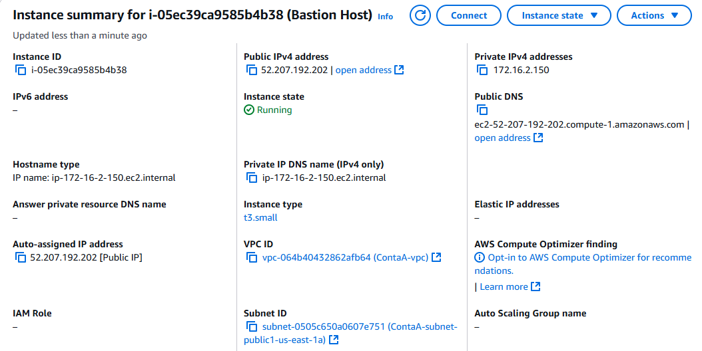

# 🧪 Laboratório AWS: Amazon WorkSpaces + Active Directory com Grupos (Labs Futuros e em Desenvolvimento)

Este laboratório demonstra a integração do **Amazon WorkSpaces** com um **Active Directory self-managed** (na Conta A), aproveitando o **AD Connector** (na Conta B).  
O controle de acesso é feito através de **grupos de usuários e administradores**, garantindo separação clara entre quem pode **usar os WorkSpaces** e quem pode **administrá-los**.

---

## 🔧 Etapas Realizadas

### 1️⃣ Configuração do AD na Conta A
- Criação da **VPC (172.16.0.0/16)** com subnets pública e privada.  
- Deploy de **EC2 Windows Server (AD DS)** na subnet privada, promovido como **Controlador de Domínio** (`empresa.local`).  
- Criação de **dois grupos no AD**:  
  - `WorkSpaces-Users`: usuários que poderão acessar o Amazon WorkSpaces.  
  - `WorkSpaces-Admins`: administradores que terão permissão de gerenciar os WorkSpaces.  
- Criação de contas de exemplo:  
  - `joao.silva` (membro do grupo `WorkSpaces-Users`).  
  - `maria.admin` (membro do grupo `WorkSpaces-Admins`).  

### 2️⃣ Configuração da VPC na Conta B
- Criação da **VPC (10.0.0.0/16)** com subnets privadas para os WorkSpaces.  

### 3️⃣ Peering entre as VPCs
- Solicitação e aceitação de **VPC Peering** entre Conta A e Conta B.  
- Rotas configuradas:  
  - **Conta A → 10.0.0.0/16** via peering.  
  - **Conta B → 172.16.0.0/16** via peering.  

### 4️⃣ Configuração de Security Groups
- Liberação de portas do AD entre as VPCs:  
  `TCP/UDP 53, 88, 389, 445, 464, 3268, 3269`.  
- Liberação do acesso RDP (`3389`) apenas para o **Bastion-Host**.  

### 5️⃣ Deploy do AD Connector (Conta B)
- Criação do **AD Connector** no **AWS Directory Service**.  
- Informado:  
  - Domínio: `empresa.local`.  
  - IPs dos DCs da Conta A.  
  - Credenciais administrativas.  
- Selecionadas as subnets privadas da Conta B.  

### 6️⃣ Deploy do Amazon WorkSpaces
- Criação de um **Directory Registration** com o AD Connector.  
- Provisionamento de **WorkSpaces para usuários do grupo `WorkSpaces-Users`**.  
- Apenas usuários pertencentes ao grupo têm acesso ao portal do Amazon WorkSpaces.  
- O grupo `WorkSpaces-Admins` tem permissão para gerenciar WorkSpaces no **AWS Management Console**.  

---

## 📷 Evidências

| Componente | Screenshot |
|------------|------------|
| VPC Conta A (AD DS) |  |
| Bastion Host |  |
| AD DS configurado |  |
| AD Connector (Conta B) |  |
| Portal Amazon WorkSpaces |  |
| Grupo WorkSpaces-Users no AD |  |
| Grupo WorkSpaces-Admins no AD |  |
| Usuário joao.silva acessando o WorkSpace |  |
| Usuário maria.admin gerenciando via Console |  |

---

## 🧠 Arquitetura.

---

## ✅ Resultados Esperados
- **Usuários do grupo WorkSpaces-Users** conseguem acessar e utilizar o Amazon WorkSpaces.  
- **Administradores do grupo WorkSpaces-Admins** podem gerenciar WorkSpaces e diretórios no console AWS.  
- O **AD Connector** garante autenticação centralizada no AD da Conta A.  
- Segurança mantida via **VPC Peering**, regras de rede e controle baseado em grupos.  

---

## 📘 Recursos Recomendados
- [Amazon WorkSpaces Documentation](https://docs.aws.amazon.com/workspaces/)  
- [AWS Directory Service – AD Connector](https://docs.aws.amazon.com/directoryservice/latest/admin-guide/directory_ad_connector.html)  
- [Active Directory Group Management](https://learn.microsoft.com/en-us/windows-server/identity/ad-ds/manage/creating-managing-groups)  
- [Best Practices for Amazon WorkSpaces](https://docs.aws.amazon.com/workspaces/latest/adminguide/best-practices.html)  
