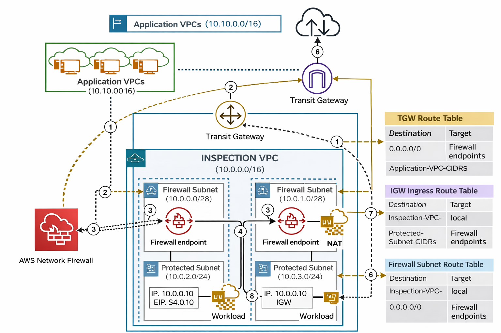
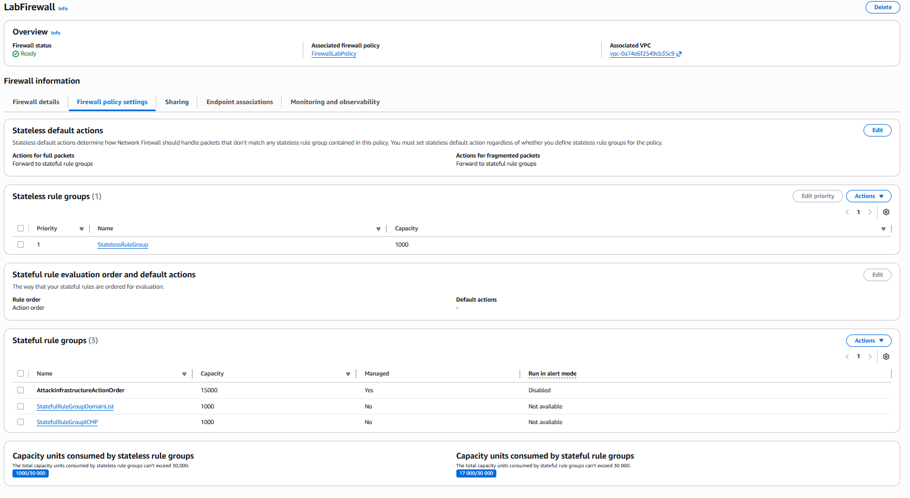
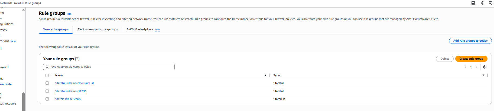
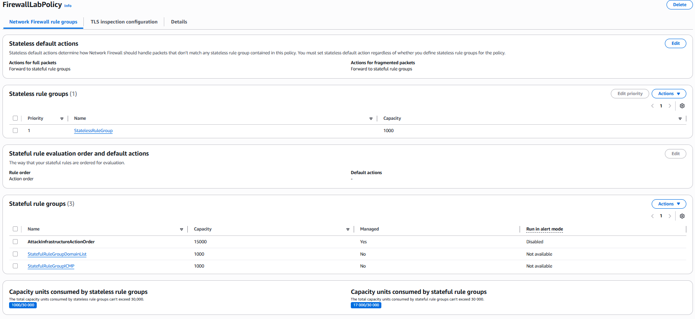
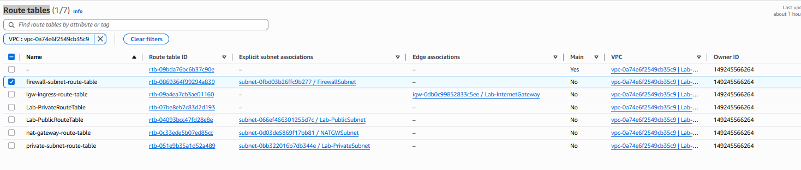
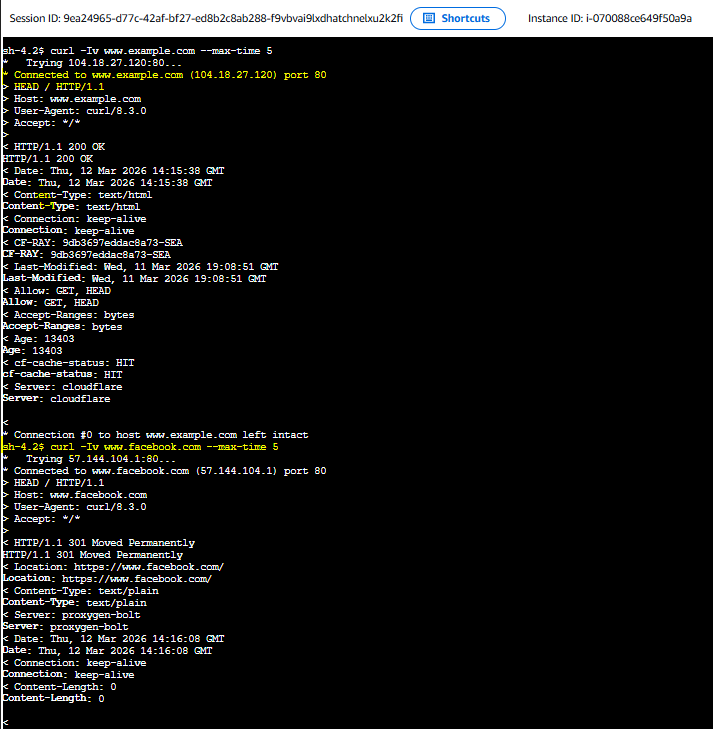
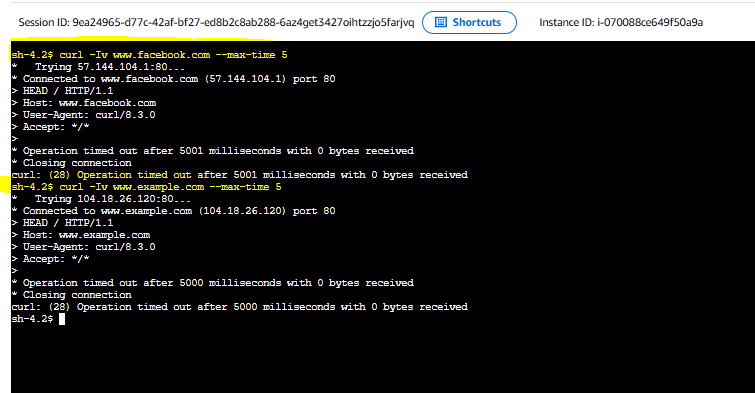
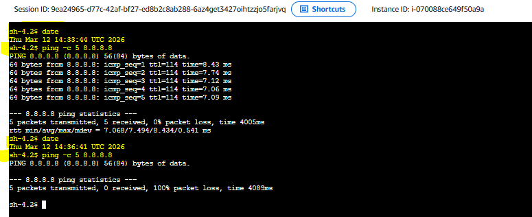
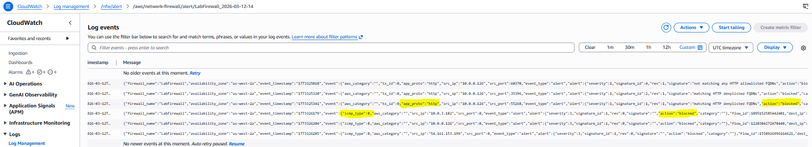

## 📚 Lab original (AWS Skill Builder)

Este laboratório demonstra a implementação de inspeção de tráfego em uma VPC utilizando o **AWS Network Firewall**. 
O laboratório demonstra como configurar o AWS Network Firewall, criar rule groups, configurar rotas da VPC e testar inspeção de tráfego HTTP e ICMP.
---

# 🏗 Arquitetura

Network Firewall | 
---
# ☁️ Arquitetura composta por: 
- **Network**: VPC; Subnets públicas e privadas; Firewall Subnet; AWS Network Firewall; NAT Gateway; EC2 Instances; Route Tables; Internet Gateway e CloudWatch Logs
- **Segurança**:AWS Network Firewall; Stateful Rule Groups e Stateless Rule Groups
- **Monitoramento**: Amazon CloudWatch Logs
- **Amazon EC2**: AWS Systems Manager (Session Manager)
---

# 📸 Evidências

| Componente | Screenshot |
|-----------|-----------|
| Network Firewall |  |
| Firewall Rules |  |
| FirewallLabPolicy |  |
| Route tables|  |
| HTTP Test |  |
| HTTP Blocked |  |
| Ping Blocked |  |
| CloudWatch Logs |  |

---

# 📊 Resultados

Arquitetura implementada com sucesso demonstrando:

- Network traffic inspection
- Domain blocking
- ICMP blocking
- NAT Gateway integration
- VPC routing through firewall
- Traffic monitoring via CloudWatch

---
