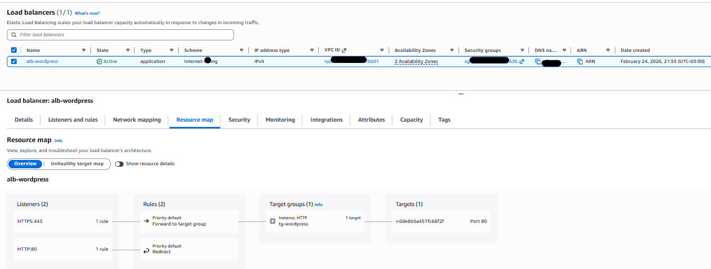
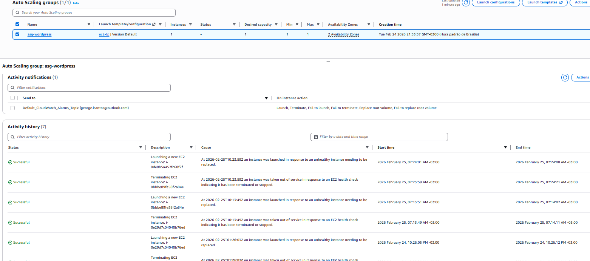
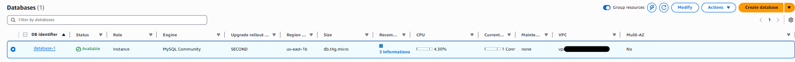

# 🌐 WordPress Altamente Disponível com Auto Scaling, RDS e EFS na AWS

Este laboratório demonstra como construir uma arquitetura **altamente disponível, escalável e resiliente** para uma aplicação WordPress na AWS, utilizando:

- Application Load Balancer
- Auto Scaling Group
- Amazon EC2
- Amazon RDS (MySQL)
- Amazon EFS
- VPC com subnets públicas e privadas

## 🎯 Objetivo

Implantar um ambiente WordPress que ofereça:

- Alta disponibilidade
- Escalabilidade automática
- Armazenamento compartilhado entre instâncias
- Banco de dados gerenciado
- Isolamento de rede com subnets privadas
- Balanceamento de carga automático

---

## 🏗️ Arquitetura

### Componentes

---

## 🚀 Serviços AWS Utilizados

- Amazon VPC
- Amazon EC2
- Amazon RDS
- Amazon EFS
- Application Load Balancer
- Auto Scaling Group
- Internet Gateway
- NAT Gateway
- Security Groups

---

## 📷 Evidências

| Componente | Screenshot |
|----------|------------|
| Load Balancer |  |
| Auto Scaling Group |  |
| EFS |  |
| RDS |  |
| WordPress funcionando |  |

---

## ✅ Resultados

✔ Alta disponibilidade  
✔ Escalabilidade automática  
✔ Failover automático  
✔ Arquitetura resiliente  
✔ Armazenamento compartilhado  
✔ Banco gerenciado  

---

## 📚 Conceitos Aplicados

- High Availability
- Fault Tolerance
- Elasticity
- Scalability
- Cloud Architecture
- AWS Networking
- Stateless Architecture

---

## 🧠 Aprendizados

Este laboratório demonstra como construir uma arquitetura de produção utilizando:

- Multi-AZ deployment
- Auto Scaling
- Load Balancing
- Shared Storage com EFS
- Banco gerenciado com RDS

---

## 🔮 Melhorias Futuras

- HTTPS com ACM
- CloudFront (CDN)
- Route 53
- AWS WAF
- Monitoramento com CloudWatch
- Infraestrutura como código com Terraform

---

## 👨‍💻 Autor

George Luis Dos Santos

AWS | DevOps | Cloud Engineer

---

## 📄 Licença

Este projeto é destinado para fins educacionais e de aprendizado.
