# Laboratório AWS: CloudFront + ALB + Auto Scaling + Route 53 + ACM + RDS + EFS

Este laboratório demonstra a implementação de uma arquitetura **altamente disponível, segura e escalável** na AWS utilizando serviços gerenciados e seguindo as boas práticas do **AWS Well-Architected Framework**, incluindo alta disponibilidade em múltiplas Availability Zones, escalabilidade automática e comunicação segura via HTTPS.

---

## Arquitetura

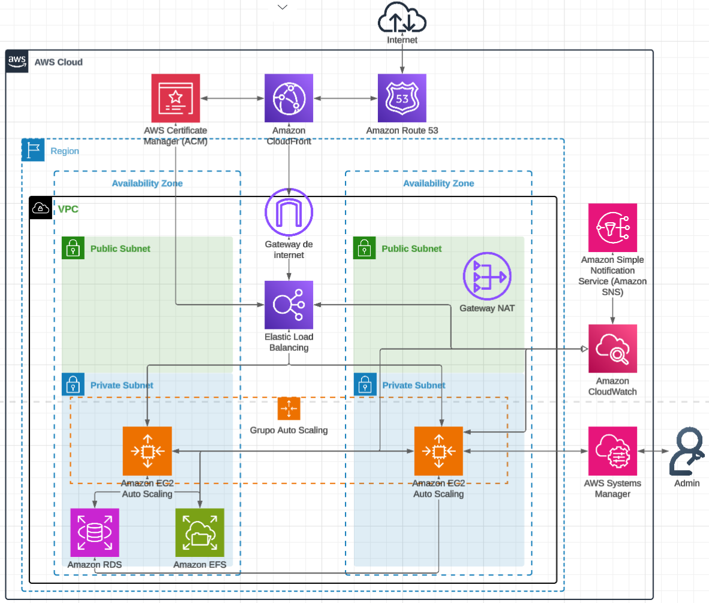

---
## Serviços utilizados

- **Rede e entrega de conteúdo**: Amazon VPC (Virtual Private Cloud); Subnets públicas e privadas em múltiplas Availability Zones; Internet Gateway; NAT Gateway; Amazon Route 53 (DNS) e Amazon CloudFront (CDN).
- **Balanceamento e escalabilidade**: Application Load Balancer (ALB); Amazon EC2 Auto Scaling Group (ASG); Amazon EC2 (instâncias em subnets privadas) e Launch Template.
- **Armazenamento e banco de dados**: Amazon RDS (banco de dados gerenciado) e Amazon EFS (Elastic File System – armazenamento compartilhado).
- **Segurança AWS Certificate Manager (ACM)**:  certificados SSL/TLS; Security Groups e Instâncias em subnets privadas (sem acesso direto da internet).
- **Gerenciamento e operação**: AWS Systems Manager (Session Manager); Amazon CloudWatch (monitoramento e métricas) e Amazon SNS (notificações e alertas)

---
---
## Fluxo da aplicação

Usuário → Route 53 → CloudFront → Application Load Balancer → EC2 (Auto Scaling Group) → RDS e EFS.
O AWS Certificate Manager (ACM) é utilizado para fornecer certificados SSL/TLS ao CloudFront e ao Application Load Balancer, garantindo comunicação segura via HTTPS.

---
---

## 📷 Evidências

| Componente | Screenshot |
|------------|------------|
| CloudFront | 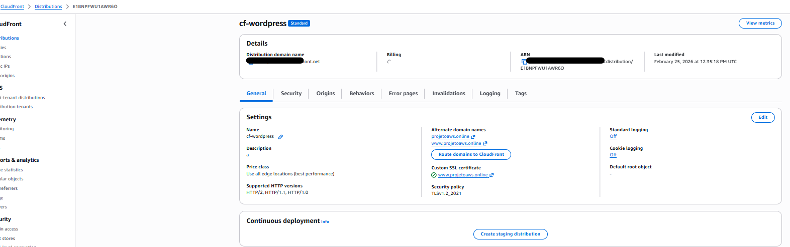 |
| Route 53 | 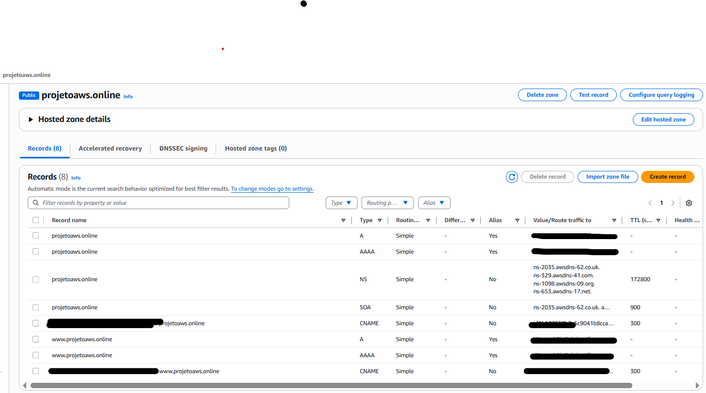 |
| Load Balancer | 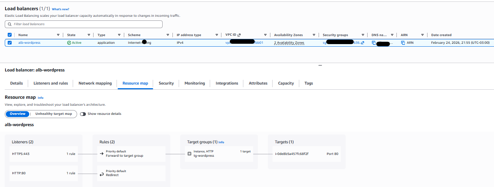 |
| Auto Scaling | 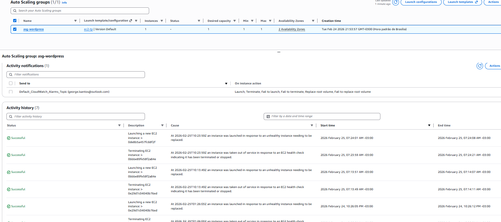 |
| EC2 | 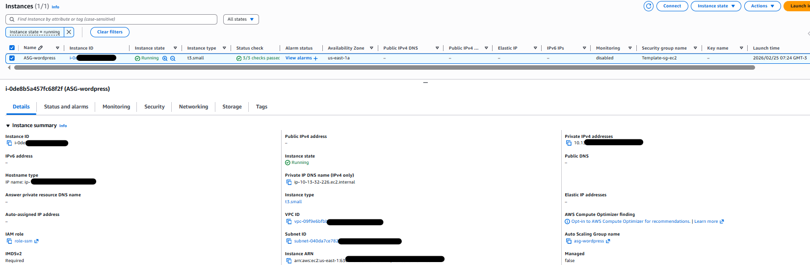 |
| RDS | 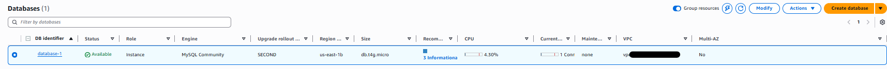 |
| ACM | 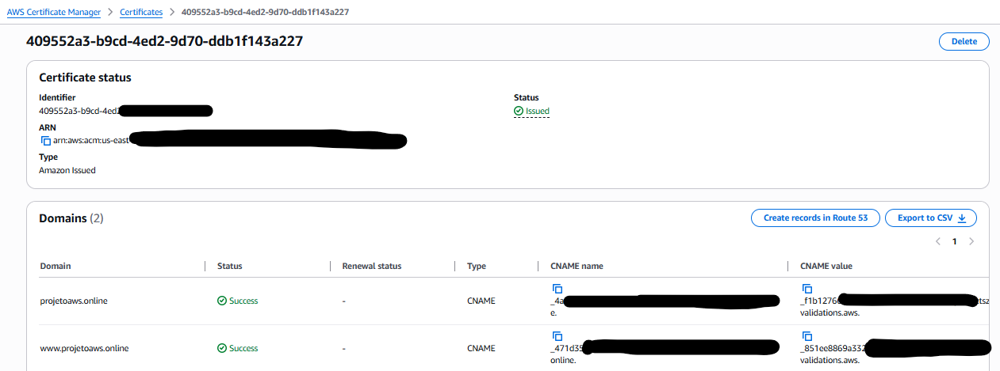 |
| Systems Manager |  |

--- 

## 📷 Evidência: Auto Scaling substituindo instância automaticamente

O Auto Scaling detectou uma instância com falha e automaticamente lançou uma nova instância saudável, garantindo alta disponibilidade da aplicação.

### Instância substituída automaticamente

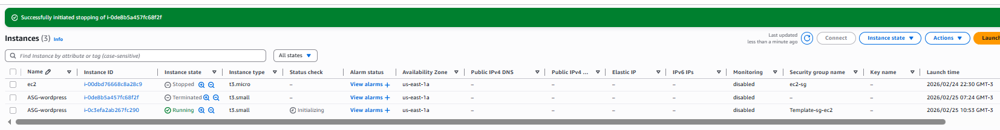
---

### Histórico do Auto Scaling mostrando substituição automática

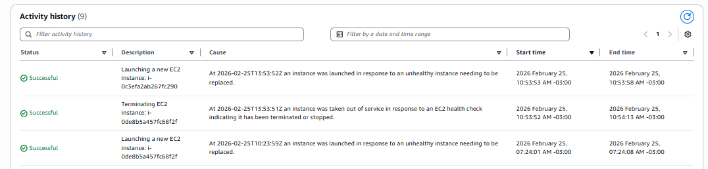

Evento registrado:

- Instância marcada como unhealthy
- Instância terminada automaticamente
- Nova instância criada automaticamente
- Aplicação permaneceu disponível sem intervenção manual

Isso demonstra: Alta disponibilidade; Self-healing architecture; Fault tolerance; Arquitetura resiliente

---
---
## 🌐 Evidência: Aplicação WordPress em funcionamento

A aplicação WordPress está publicada e acessível via CloudFront, com balanceamento de carga pelo Application Load Balancer e instâncias gerenciadas pelo Auto Scaling Group.

### Página About do site

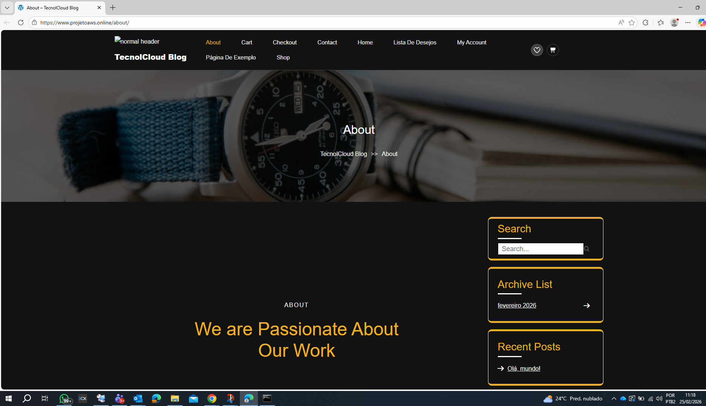

URL de acesso:

https://www.projetoaws.online

Esta evidência demonstra:

- Aplicação totalmente funcional
- Integração com CloudFront
- Balanceamento de carga com ALB
- Escalabilidade com Auto Scaling
- Backend com RDS e EFS
- Comunicação segura via HTTPS (ACM)

---
## ✅ Resultado

Infraestrutura **altamente disponível, segura e escalável**, com: Balanceamento de carga; Escalabilidade automática; Comunicação segura via HTTPS; Instâncias em subnets privadas; Banco de dados gerenciado; Sistema de arquivos compartilhado e Gerenciamento seguro via Systems Manager  

Arquitetura alinhada com:

- AWS Well-Architected Framework  
- AWS Solutions Architect Associate  
- AWS Solutions Architect Professional  

---

## 📚 Autor

Projeto criado para fins de estudo e prática em arquitetura AWS.

