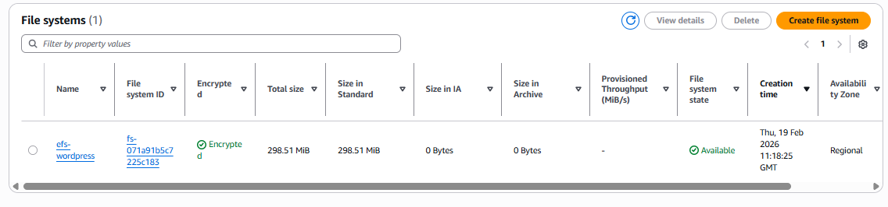

# Laboratório AWS: CloudFront + ALB + Auto Scaling + Route 53 + ACM + RDS + EFS

Este laboratório demonstra a implementação de uma arquitetura **altamente disponível, segura e escalável** na AWS utilizando **CloudFront, Application Load Balancer, Auto Scaling, Route 53, ACM, RDS, EFS e Systems Manager**, seguindo boas práticas do AWS Well-Architected Framework.

---

## Arquitetura

---

## Serviços utilizados 
Amazon VPC (Subnets públicas e privadas); Amazon EC2 com Auto Scaling Group - Application Load Balancer (ALB); Amazon CloudFront; Amazon Route 53; AWS Certificate Manager (ACM); Amazon RDS; Amazon EFS; NAT Gateway e Internet Gateway; AWS Systems Manager; Security Groups e Launch Template; 

---

## Fluxo da aplicação

Usuário → Route 53 → CloudFront → Application Load Balancer → EC2 (Auto Scaling Group) → RDS e EFS

---

## 📷 Evidências

| Componente | Screenshot |
|------------|------------|
| Arquitetura |  |
| VPC |  |
| CloudFront |  |
| Route 53 |  |
| ACM |  |
| Load Balancer |  |
| Auto Scaling |  |
| EC2 |  |
| RDS |  |
| EFS |  |
| Systems Manager |  |

---

## ✅ Resultado

Infraestrutura **altamente disponível, segura e escalável**, com:

- Balanceamento de carga  
- Escalabilidade automática  
- Comunicação segura via HTTPS  
- Instâncias em subnets privadas  
- Banco de dados gerenciado  
- Sistema de arquivos compartilhado  
- Gerenciamento seguro via Systems Manager  

Arquitetura alinhada com:

- AWS Well-Architected Framework  
- AWS Solutions Architect Associate  
- AWS Solutions Architect Professional  

---

## 📚 Autor

Projeto criado para fins de estudo e prática em arquitetura AWS.
