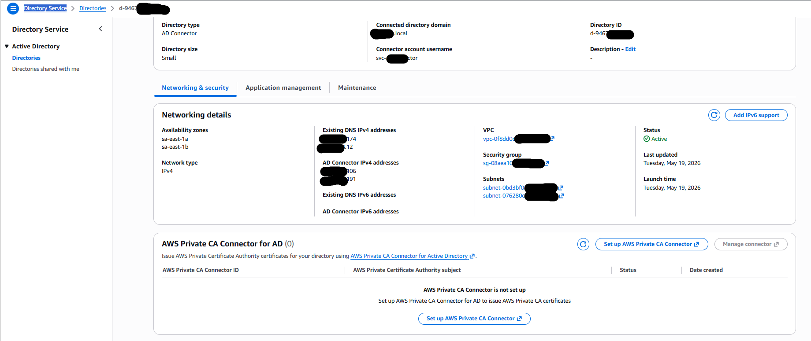
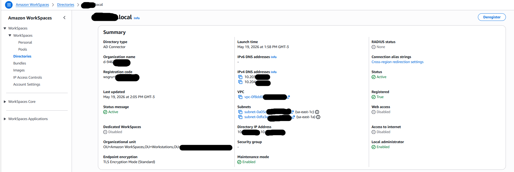
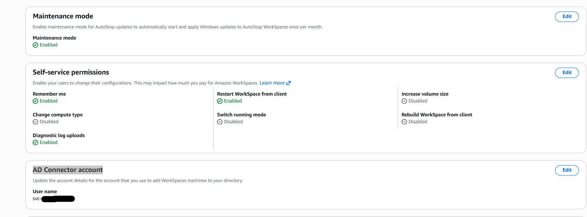
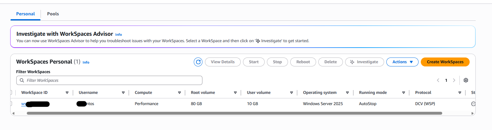
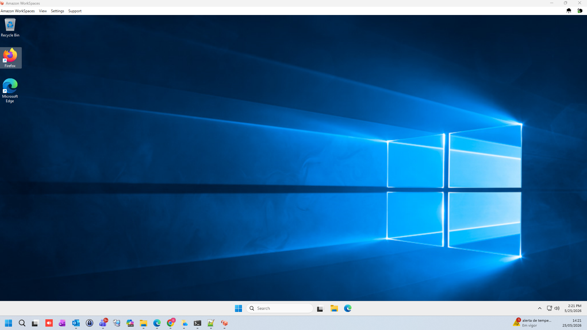

# ☁️ Laboratório AWS WorkSpaces + Active Directory Connector + Session Manager

Este laboratório demonstra a implementação de uma solução de **Desktop Virtual na AWS** utilizando o **Amazon WorkSpaces** integrado ao **Microsoft Active Directory On-Premises** através do **AWS Directory Service (AD Connector)**.

A arquitetura foi construída seguindo boas práticas de:
- Segurança; Gerenciamento centralizado; Acesso remoto corporativo; Administração sem exposição pública; Integração híbrida entre AWS e Active Directory

---

# 🚀 Serviços AWS Utilizados

## 🖥️ Computação e Desktop Virtual
- Amazon WorkSpaces; Amazon EC2 e WorkSpaces Personal

## 🔐 Diretório e Identidade
- AWS Directory Service; AD Connector; Microsoft Active Directory

## 🌐 Rede
- Amazon VPC; Subnets privadas e Security Groups

## 🛠️ Gerenciamento e Operação
- AWS Systems Manager (Session Manager); CloudWatch e IAM

---

# 🔄 Fluxo da Solução

Usuário → Amazon WorkSpaces → AD Connector → Active Directory → Recursos corporativos

O AD Connector realiza a autenticação dos usuários diretamente no Active Directory sem armazenar credenciais na AWS.

O AWS Systems Manager foi utilizado para administração segura das instâncias sem necessidade de acesso via bastion host ou RDP exposto na internet.

---

# 🔐 Segurança Implementada

- WorkSpaces integrados ao Active Directory
- Instâncias privadas sem IP público
- Administração via Systems Manager
- Controle de acesso via Security Groups
- Autenticação centralizada no AD
- Comunicação segura dentro da VPC

---

# 📷 Evidências do Laboratório

| Componente | Screenshot |
|------------|------------|
| AWS Directory Service |  |
| Amazon WorkSpaces Directory |  |
| AD Connector Account |  |
| WorkSpace Criado |  |
| Ambiente Windows no WorkSpaces |  |

---

# 📷 Evidência: AWS Directory Service

O AD Connector foi configurado com sucesso integrado ao domínio Active Directory corporativo.

### Informações do ambiente

- Tipo de diretório: AD Connector
- Domínio conectado: trustee.local
- Multi-AZ habilitado
- Status: Active

---

# 📷 Evidência: Registro do Amazon WorkSpaces

O diretório foi registrado com sucesso no Amazon WorkSpaces permitindo provisionar desktops virtuais para usuários do Active Directory.

---

# 📷 Evidência: Conta do AD Connector

A conta de serviço utilizada para integração com o Active Directory foi configurada corretamente no WorkSpaces.

---

# 📷 Evidência: Provisionamento do WorkSpace

Desktop virtual provisionado com sucesso para o usuário do domínio.

### Configurações do WorkSpace

- Sistema Operacional: Windows Server 2025
- Running Mode: AutoStop
- Protocolo: DCV (WSP)
- Compute Type: Performance

---

# 📷 Evidência: Ambiente Windows em Execução

O ambiente Windows do Amazon WorkSpaces foi acessado com sucesso demonstrando funcionamento correto da integração com Active Directory.

---

# ✅ Resultado Final

Infraestrutura funcional de Desktop Virtual utilizando Amazon WorkSpaces integrada ao Active Directory corporativo com:

- Provisionamento centralizado de desktops
- Integração híbrida com AD
- Administração segura
- Ambientes privados
- Escalabilidade gerenciada
- Alta disponibilidade Multi-AZ

---

# 🎯 Conceitos Aplicados

- Amazon WorkSpaces
- AWS Directory Service
- AD Connector
- Active Directory Integration
- Hybrid Cloud
- AWS Systems Manager
- Segurança em ambientes corporativos
- Virtual Desktop Infrastructure (VDI)

---

# 📚 Aprendizados

Durante este laboratório foram praticados conceitos importantes de:

- Integração híbrida AWS + Active Directory
- Provisionamento de desktops virtuais
- Gerenciamento seguro sem RDP público
- Administração centralizada
- Arquitetura corporativa na AWS

---

# 👨‍💻 Autor

Projeto criado para fins de estudo, prática e evolução em arquitetura AWS e ambientes corporativos híbridos.