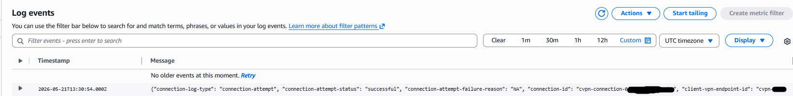
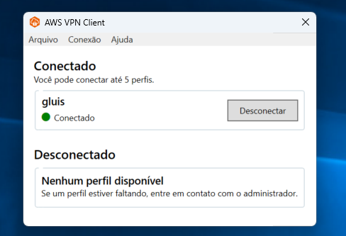
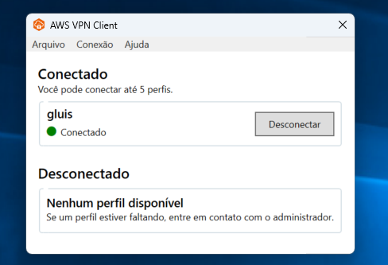
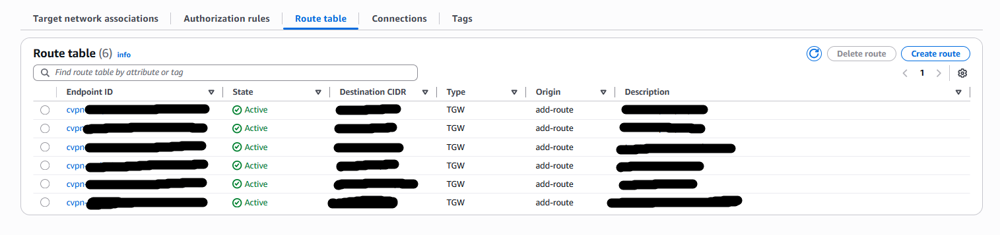
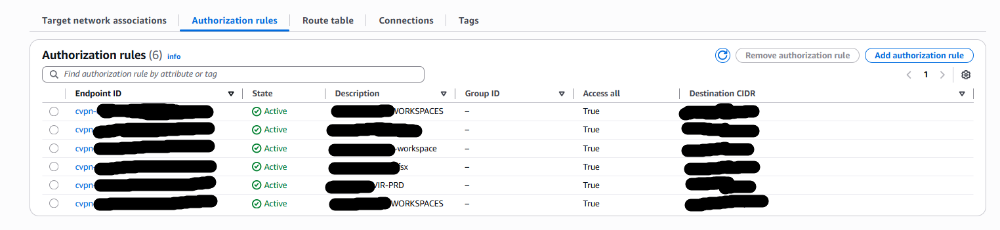
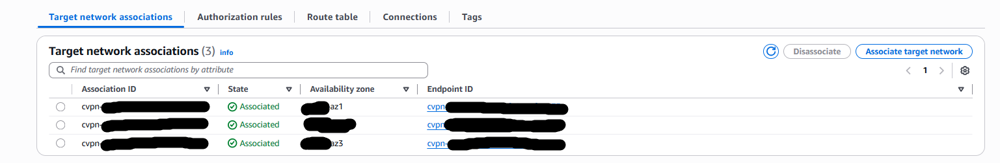

# 🔐 Laboratório AWS Client VPN + Hybrid Connectivity

Este laboratório demonstra a implementação de conectividade segura entre usuários remotos e ambientes AWS utilizando o AWS Client VPN integrado a múltiplas VPCs através do AWS Transit Gateway.

A solução foi construída seguindo boas práticas de:

- Segurança
- Conectividade híbrida
- Administração centralizada
- Controle de acesso
- Monitoramento de conexões VPN

---

# 🏗️ Arquitetura

---

# 🚀 Serviços AWS Utilizados

## 🌐 Rede e conectividade
- AWS Client VPN
- Amazon VPC
- AWS Transit Gateway
- Route Tables
- Authorization Rules

## 📊 Monitoramento
- Amazon CloudWatch Logs

## 🔐 Segurança
- Regras de autorização
- Controle de rotas
- Acesso privado às redes internas

---

# 📌 Objetivo do Laboratório

O objetivo deste projeto foi implementar:

- Acesso remoto seguro à AWS
- Conectividade híbrida
- Comunicação entre múltiplas VPCs
- Gerenciamento centralizado de rotas
- Monitoramento de conexões VPN

---

# 🔄 Fluxo da Solução

Usuário → AWS VPN Client → AWS Client VPN Endpoint → Transit Gateway → VPCs privadas

O AWS Client VPN permite acesso seguro aos ambientes internos utilizando criptografia e controle de autorização baseado em regras de rede.

---

# 🔐 Segurança Implementada

- Acesso autenticado via AWS Client VPN
- Rotas privadas através do Transit Gateway
- Regras de autorização por CIDR
- Logs centralizados no CloudWatch
- Ambientes privados sem exposição pública

---

# 📷 Evidências

| Componente | Screenshot |
|------------|------------|
| CloudWatch Logs |  |
| VPN Connections |  |
| AWS VPN Client |  |
| Route Table |  |
| Authorization Rules |  |
| Target Network Associations |  |

---

# 📷 Evidência: VPN Conectada

O cliente AWS VPN Client conectou com sucesso ao endpoint AWS Client VPN permitindo acesso seguro aos ambientes privados.

---

# 📷 Evidência: Logs no CloudWatch

Os logs de conexão VPN foram enviados corretamente ao Amazon CloudWatch Logs permitindo auditoria e monitoramento das conexões.

---

# 📷 Evidência: Rotas Privadas

As rotas foram propagadas corretamente através do Transit Gateway permitindo acesso entre ambientes internos.

---

# 📷 Evidência: Authorization Rules

As regras de autorização foram configuradas permitindo acesso controlado às redes privadas.

---

# ✅ Resultado Final

Infraestrutura segura de conectividade híbrida utilizando AWS Client VPN com:

- Acesso remoto seguro
- Integração entre múltiplas VPCs
- Monitoramento centralizado
- Controle de acesso por regras
- Conectividade privada

---

# 🎯 Conceitos Aplicados

- AWS Client VPN
- Transit Gateway
- Hybrid Connectivity
- Route Propagation
- Authorization Rules
- CloudWatch Logs
- Network Security

---

# 👨‍💻 Autor

Projeto criado para fins de estudo e prática em arquitetura de redes e conectividade segura na AWS.